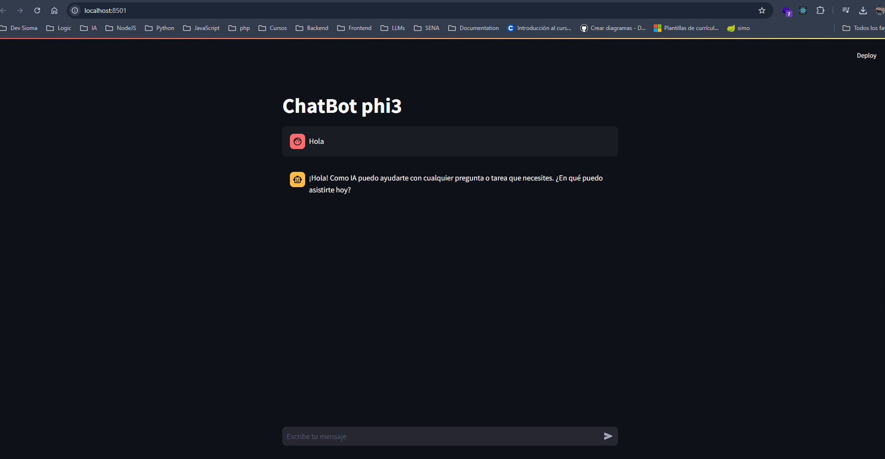

# ChatBot phi3

Este es un chatbot AI creado con Streamlit y la biblioteca `langchain_community`.

## Instalación

Para instalar las dependencias necesarias, ejecuta el siguiente comando en tu terminal:
  pip install -r requirements.txt

## Ejecucion 
Antes de ejecutar debe de estar sobre venv del proyecto
  streamlit run main.py

